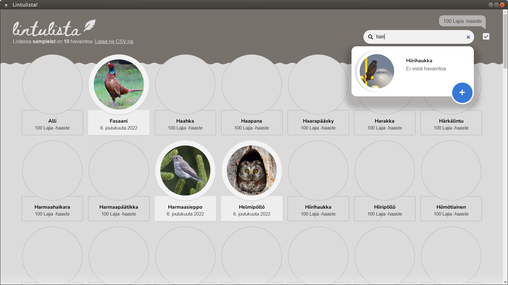

# lintulista-electron

[Electron](https://www.electronjs.org/) wrapping to convert the deprecated SaaS web app previously made up of [lintulista-client](https://github.com/leikareipa/lintulista-client) and [lintulista-server](https://github.com/leikareipa/lintulista-server) into a desktop app.

This project is work in progress.

## Getting started

1. Install dependencies: `$ yarn run install-all`
2. Refresh the distributable: `$ yarn run build-all`
3. View the sample list: `$ cd distributable && ./lintulista samplelst && cd -`
